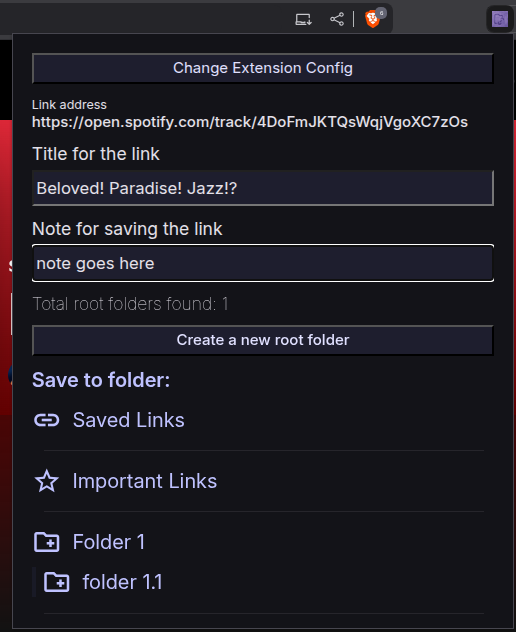
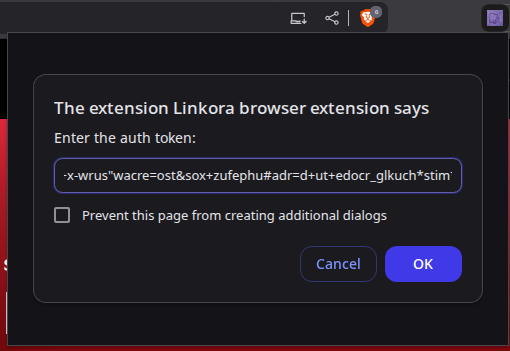
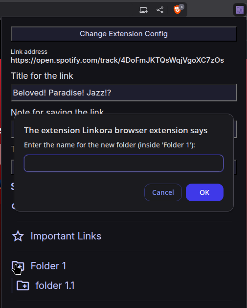
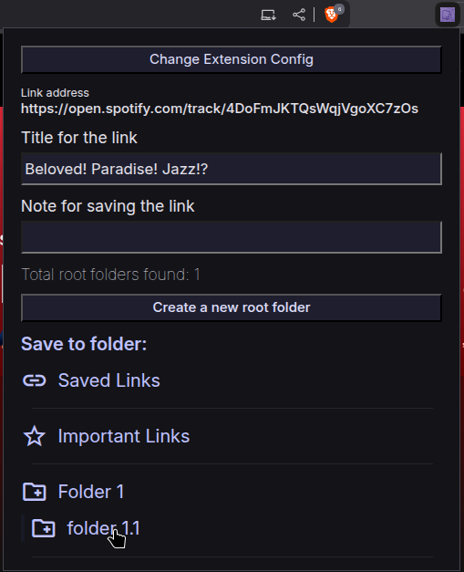

# Linkora Browser Extension

Browser extension that adds "Share from other app" functionality to web browsers. Integrates with your Linkora Sync-Server to save and sync web page links with metadata.

## Quick Start

### Prerequisites
Ensure your Linkora Sync-Server is running and accessible.

### Installation
The extension is not yet available on official web stores. Manual installation is required:

1. **Download**: Get the latest release from the [Linkora Browser Extension Releases](https://github.com/linkora/browser-extension/releases) page

2. **Extract**: Unzip the downloaded file to a dedicated folder

3. **Load Extension**:

   **Chromium-based browsers** (Chrome, Brave, Edge):
   - Navigate to `chrome://extensions` (or `brave://extensions`, `edge://extensions`)
   - Enable "Developer mode"
   - Click "Load unpacked" and select the extracted folder

   **Firefox**:
   - Go to `about:debugging#/runtime/this-firefox`
   - Click "Load Temporary Add-on..." and select `manifest.json` from the extracted folder
   - *Note*: Firefox requires reloading the extension after each browser restart

### Configuration
After installation:

1. Click the Linkora icon in your browser toolbar
2. Enter your Linkora Sync-Server URL (e.g., `https://YOUR_SERVER_IP:PORT`)
3. Provide the `serverAuthToken` configured on your Sync-Server

### HTTPS Certificate Setup (Important)
For HTTPS functionality, proper certificate configuration is required:

**Chromium-based Browsers**: Import the certificate (`.pem` file) generated by your Sync-Server into your browser's trusted root certification authorities.

**Firefox**: Go to `about:preferences#privacy` → "View Certificates" → "Servers" and add your server URL with port.

## Compatibility

### Server Requirements
Requires a running Linkora Sync-Server instance. The server provides the UI components and handles synchronization logic.

*Future Update*: Direct communication with the Linkora desktop app will be supported in an upcoming release.

### Browser Support
**Tested**: Firefox and Brave

**Known Issues**: Zen browser (Firefox-based) experiences crashes during extension loading.

## Features

**Web Content Capture**: Saves web page metadata (URL, title, image) with optional notes into chosen folders. Replicates the mobile app's "Share from other app" workflow for desktop browsers.

**Sync-Server Integration**: Connects to your self-hosted Linkora Sync-Server for synchronization across devices.

**Hybrid Architecture**: Server-rendered UI with client-side browser operations.

## Screenshots
| | | | |
|---|---|---|---|
|  |  |  |  |

Clicking on the folder name (in the last image) will save the link into that folder.

## Support
**Star the repo** if you find Linkora useful

## License
This extension is licensed under the MIT License.
